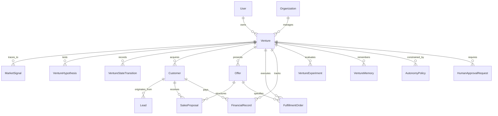

# Trendly Autonomous AI Venture OS — Architecture Specification

## 1. Executive Summary & Objective

Trendly evolves from an AI opportunity and agent platform into a production-grade **AI Venture Operating System**. The core mandate is not maximizing token consumption or superficial agent generation, but driving verified economic outcomes:

$$\text{Market Signal} \longrightarrow \text{Problem} \longrightarrow \text{Opportunity} \longrightarrow \text{Demand Validation} \longrightarrow \text{Venture} \longrightarrow \text{Offer} \longrightarrow \text{Product/Service} \longrightarrow \text{Customer} \longrightarrow \text{Sales} \longrightarrow \text{Payment} \longrightarrow \text{Fulfillment} \longrightarrow \text{Revenue} \longrightarrow \text{Cost} \longrightarrow \text{Profit} \longrightarrow \text{Outcome} \longrightarrow \text{Learning} \longrightarrow \text{Capital Allocation} \longrightarrow \text{Scale / Pivot / Pause / Kill}$$

Every number in the system carries provenance:
- `PROJECTED`: Statistical/algorithmic forecast before deployment.
- `ESTIMATED`: Model-derived proxy based on observable market data.
- `ACTUAL`: Recorded operational transaction or unverified metric.
- `VERIFIED`: Reconciled against ground-truth financial rails (Stripe/USDC ledger/bank).

---

## 2. System Inventory & Component Reuse Mapping

### 2.1 Preserved and Reused Systems
1. **Trend Ingestion & Raw Signals (`lib/pipeline/`, `prisma/schema.prisma:Trend`, `RawSignal`)**:
   - Reused as the raw feed for the Opportunity Intelligence layer.
2. **Jev Decision Stack & Calibration Layer (`lib/intelligence/decision/jev.ts`, `lib/observability/`)**:
   - `DecisionLog`, `DecisionOutcome`, `CalibrationSnapshot`, `DynamicGateConfig`.
   - Used as the foundational gating engine for autonomous transitions, risk checks, and threshold tuning across all venture lifecycle gates.
3. **Ledger & Settlement Engine (`lib/money/ledger.ts`, `lib/money/settlement.ts`)**:
   - Append-only, double-entry transactional ledger tracking balance movements, deposits, and earnings.
4. **Execution Runners (`lib/execution/runners/`, `lib/execution/engine.ts`)**:
   - Reused for code generation, deployment shims, and artifact production.
5. **Specialist Agents (`lib/agents/`)**:
   - `reddit-scraper.ts` (Lead qualification & demand intelligence).
   - `prediction-arbitrage.ts` (Market arbitrage & pricing discovery).
   - `micro-saas-builder.ts` & `openclaw-deployer.ts` (Venture builder & deployment engine).
   - `ai-video-maker.ts` (Marketing asset generation).

### 2.2 Re-architected and New Components
1. **Venture Domain Core (`lib/venture/`)**:
   - First-class Venture lifecycle entity, state machine, transitions, memory, and graveyard.
2. **Opportunity Intelligence & Demand Validation (`lib/opportunity/`)**:
   - Multi-source signal aggregation, deduplication, problem clustering, and empirical demand scoring (pain, urgency, intent, willingness to pay).
3. **Customer & Acquisition Engine (`lib/customer/`)**:
   - Unified CRM, lead scoring, outreach attribution, and proposal pipeline.
4. **Sales Agent & Proposal Generator (`lib/sales/`)**:
   - Verified objection handling, transparent quotation, and deal structuring.
5. **Fulfillment Engine (`lib/fulfillment/`)**:
   - Delivery order tracking, milestone verification, automated QA inspection, and customer acceptance criteria.
6. **Financial Truth Layer (`lib/finance/`)**:
   - Revenue, cost, and margin engine tracking compute, API, infra, Stripe fees, and net profit per venture.
7. **Hierarchical Multi-Agent Operating System (`lib/council/orchestration/`)**:
   - Deterministic hierarchy: CEO Agent -> (CFO, CTO, CMO/Growth, Sales, Ops, Research, Customer Success).
   - Deterministic business logic for state transitions; LLMs reserved for structured reasoning, synthesis, and hypothesis generation.
8. **Autonomy Control Plane & Human Approval Center (`lib/autonomy/`)**:
   - Autonomy Levels 0 to 5.
   - Guardrails restricting irreversible actions, real financial disbursements, or high-risk communications.

---

## 3. Database Architecture (Prisma Schema Extensions)



### 3.1 Primary Entities
1. **`Venture`**:
   - ID, OwnerID, TenantID, Name, Description, Slug, BusinessModel, LifecycleState, TargetCustomer, Industry, RiskLevel, CapitalAllocated, CapitalConsumed, Currency.
2. **`VentureStateTransition`**:
   - VentureID, FromState, ToState, Reason, Actor, DecisionLogID, EvidenceJson, CreatedAt.
3. **`MarketSignal`**:
   - Source (`reddit`, `hackernews`, `github`, `search`, `custom`), ExternalURL, ProblemStatement, UrgencyScore, IntentScore, Provenance (`OBSERVED`, `INFERRED`, `MODEL_ESTIMATE`, `USER_PROVIDED`).
4. **`DemandValidation`**:
   - SignalID / VentureID, CustomerPainEvidence, WillingnessToPayEvidence, MarketSaturationScore, TechnicalFeasibilityScore, Recommendation (`VALIDATE`, `REJECT`, `DEFER`).
5. **`VentureHypothesis`**:
   - Problem, TargetPersona, ProposedSolution, ValueProp, PricingModel, UnitEconomics, SuccessCriteria, FailureCriteria.
6. **`Offer`**:
   - VentureID, Name, Tier, PriceCents, BillingInterval, Features, Deliverables, Constraints.
7. **`Customer` & `Lead`**:
   - VentureID, Channel, ContactHandle, IntentScore, PipelineStatus (`NEW`, `QUALIFIED`, `PROPOSAL_SENT`, `NEGOTIATING`, `WON`, `CHURNED`), LifetimeValueCents, AcquisitionCostCents.
8. **`FulfillmentOrder`**:
   - VentureID, CustomerID, OfferID, ScopeJson, Status (`PENDING`, `IN_PROGRESS`, `QA_VERIFICATION`, `DELIVERED`, `DISPUTED`), DeliveryArtifactsJson, VerificationEvidence.
9. **`FinancialRecord`**:
   - VentureID, CustomerID, OrderID, Type (`REVENUE`, `REFUND`, `STRIPE_FEE`, `AI_COMPUTE_COST`, `INFRA_COST`, `MARKETING_COST`, `OPERATIONAL_COST`), AmountCents, Currency, Provenance (`PROJECTED`, `ESTIMATED`, `ACTUAL`, `VERIFIED`), StripeChargeID, LedgerEntryID.
10. **`VentureExperiment`**:
    - VentureID, Hypothesis, VariableTested, BaselineMetric, TargetMetric, ActualMetric, OutcomeDecision (`SCALE`, `ITERATE`, `ABANDON`), Status.
11. **`VentureMemory`**:
    - VentureID, Category (`CUSTOMER_OBJECTION`, `PRICING_FEEDBACK`, `TECHNICAL_FAILURE`, `MARKET_INSIGHT`, `LESSON`), Observation, SupportingData, Confidence.
12. **`AutonomyPolicy` & `HumanApprovalRequest`**:
    - VentureID, MaxAutonomousSpendCents, AutonomyLevel (0-5), AllowedActions, BlockedActions.
    - Pending requests tracking proposed action, risk score, estimated cost, and review status.

---

## 4. Venture State Machine

Explicit lifecycle progression:
1. `DISCOVERED`: Market signal ingested and raw opportunity identified.
2. `RESEARCHING`: Competitive intelligence and customer persona profiling active.
3. `VALIDATING`: Empirical demand validation in progress (surveys, search traffic, direct problem queries).
4. `VALIDATED`: Sufficient evidence gathered (urgency score >= 75, willingness to pay demonstrated).
5. `BUILDING`: Core MVP, landing page, or service delivery pipeline in production.
6. `READY_TO_SELL`: Offer published, Stripe checkout active, acquisition channels hooked.
7. `SELLING`: Outbound / inbound acquisition active; proposals generated and pitched.
8. `FIRST_REVENUE`: Reconciled initial customer payment received through financial rails.
9. `DELIVERING`: Fulfillment order in progress meeting defined QA acceptance criteria.
10. `PROFITABLE`: Net verified revenue exceeds total operating and development costs.
11. `SCALING`: Capital reinvested into customer acquisition and capacity expansion.
12. `PAUSED`: Execution suspended by human operator or circuit breaker.
13. `KILLED`: Terminated due to invalidated demand, negative unit economics, or failure criteria.
14. `ARCHIVED`: Transferred to Venture Graveyard as permanent organizational intelligence.

---

## 5. Multi-Agent Hierarchy & Orchestration

```
                      +-------------------+
                      |     CEO AGENT     |
                      | "What happens     |
                      |      next?"       |
                      +---------+---------+
                                |
       +-----------+------------+------------+-----------+
       |           |            |            |           |
+------v----+ +----v----+ +-----v----+ +-----v----+ +----v----+
| CFO AGENT | |CTO/ENG  | |  GROWTH  | |  SALES   | |OPERATIONS|
| Unit Econ | |Builder  | |Acquisit. | |Proposals | |Fulfillmt |
+-----------+ +---------+ +----------+ +----------+ +---------+
       |           |            |            |           |
       +-----------+------------+------------+-----------+
                                |
             +------------------+------------------+
             |                                     |
      +------v-------+                      +------v-------+
      |RESEARCH AGENT|                      |SUCCESS AGENT |
      |Signals/Trends|                      |Retention/LTV |
      +--------------+                      +--------------+
```

### 5.1 Operational Disciplines
- **Deterministic Workflows**: Database mutations, financial tallying, state validation, and quota enforcement use standard TypeScript business logic.
- **Probabilistic Reasoning**: LLMs are isolated behind typed schema extractors, evaluation rubrics, and Jev gatekeeper checks.
- **Fail-Safe Circuit Breaker**: If unit economics turn negative (e.g. AI cost / revenue > 0.40) or error rate exceeds threshold, the autonomous engine automatically transitions the venture to `PAUSED` and triggers an escalation event.

---

## 6. Financial Architecture & Provenance Verification

1. **Revenue Recognition**:
   - Zero revenue is recognized from AI forecasts or simulated buyer replies.
   - `VERIFIED` revenue requires:
     - Stripe Webhook Signature verification (`invoice.payment_succeeded` or `charge.succeeded`).
     - Idempotency check against existing `FinancialRecord.stripeChargeId`.
     - Transactional settlement entry into `LedgerEntry`.
2. **AI & Compute Cost Allocation**:
   - Every agent execution attributes token consumption (`prompt_tokens`, `completion_tokens`) and USD cost to the specific `VentureID` and `TaskID`.
   - Continuous real-time calculation of:
     - $\text{AI Cost / Gross Revenue}$
     - $\text{Customer Acquisition Cost (CAC)}$
     - $\text{Lifetime Value (LTV)}$
     - $\text{Net Profit Margin}$

---

## 7. Autonomy Control Plane & Guardrails

| Level | Name | Scope of Autonomous Execution |
|---|---|---|
| **0** | Observation | Read-only telemetry. Zero automated changes. |
| **1** | Recommendation | Agent produces candidate tasks and recommendations; human must trigger. |
| **2** | Staged Action | Agent drafts code, landing pages, or proposals; human must approve execution. |
| **3** | Low-Risk Auto | Autonomous signal scanning, market research, and lead qualification. |
| **4** | Bound Execution | Full execution within hard financial caps (e.g., <$25 AI spend, 0 live financial commitments without pre-authorization). |
| **5** | High Autonomy | End-to-end autonomous lifecycle constrained strictly by hard budget and compliance policies. |

**Hard Stop Boundaries**:
- Real money disbursements outside pre-funded escrow.
- Deletion of customer or production data.
- Sending unapproved unsolicited bulk communications.
- Direct-to-production deployment of unverified code artifacts.

---

## 8. Rollback & Migration Strategy

- **Zero-Downtime Prisma Migration**: All new venture models are additive. Existing `Trend`, `Task`, `UserTask`, and `Web4Agent` models remain untouched or linked via optional foreign keys (`ventureId`).
- **Data Integrity**: Database push uses non-destructive additive DDL. Existing records continue functioning uninterrupted.
- **Telemetry Backward Compatibility**: Existing `DecisionLog` and `AgentRun` models are linked directly to `Venture` records via nullable relational IDs.
